# Game Review
#### Topics on Game Development, VR/AR
##### By Ari Mahardika Ahmad Nafis (05111850010027)

## About DOTA 2
Dota 2 is a multiplayer online battle arena (MOBA) video game developed and published by Valve Corporation. The game is a sequel to **Defense of the Ancients** (DotA), which was a community-created mod for Blizzard Entertainment's Warcraft III: Reign of Chaos and its expansion pack, The Frozen Throne. 

# DOTA 2 Analyzed
## Game Space
[//]: # (Focus from real world to game world)

## Boundaries
[//]: # (Can be physical or psychological)
The "physical" boundaries of this game is the game itself.

The "psychological" boundaries is when the matchmaking found a match and you click "ACCEPT".

## Rule of Interaction
[//]: # (Between player with player or player with artifact)
Rule of interaction : 

* Player with player : 
    * Player can play solo and teamed with another 4 person that is also playing solo while against a 5 person that also queued solo.
    * Player can play with party of friend up to 5 player against another party of player.
* Player with artifact :
    * Artifact

## Artifacts 
[//]: # (Artifact is passive object player interact with, every game have artifact)
### Buildings

Building Name | Building Image
-----------| ------------
Ancients | 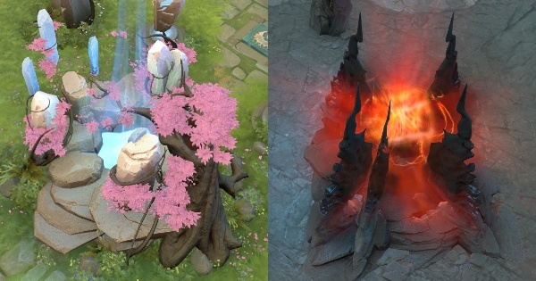
Fountains | 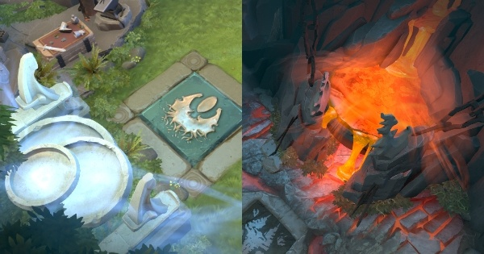
Tower | 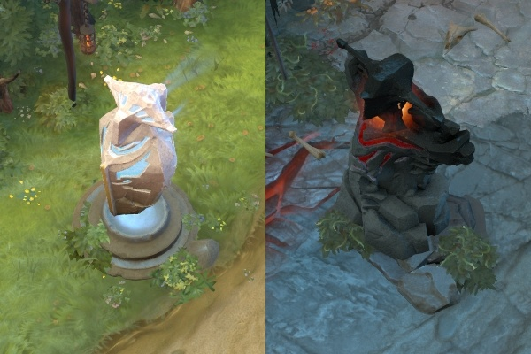
Shrines | 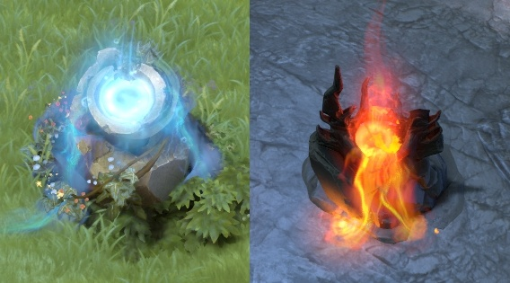
Barracks | 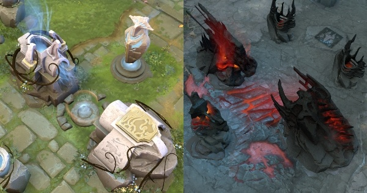
Pillars | 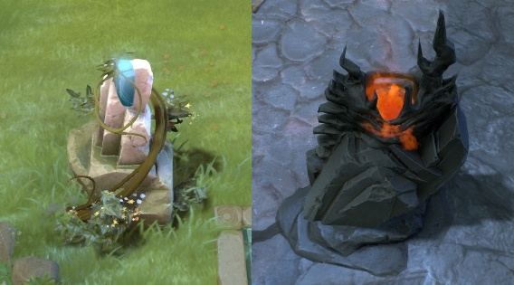

### Runes
Runes Name | Runes Image
-----------| ------------
Double Damage | 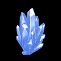
Haste | 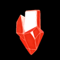
Illusion | 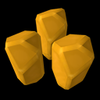
Regeneration | 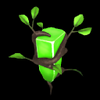
Invisibility | 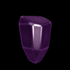
Arcane | 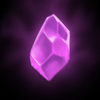
Bounty | 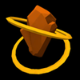

### Terrain
Name | Image
-----------| ------------
Trees | 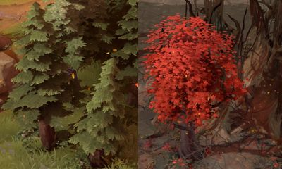

## Goal
The goal of DOTA 2 is being the first team to destroy a large structure located in opposing team's base called the "Ancient" while in the same time defense its own team "Ancient", hence the name "Defence of the Ancient".

# Gameplay 
[//]: # (How the player interact with the game:)
## Game Rules

## Plot

## Objectives
Destroy the opposing team's Ancient.

## Challenges
* The opposing team also try to destroy your own team's ancient.
* There is lot of tower that you must destroy first before you can destroy enemy ancients

# Game Mechanics
[//]: # (Construct of methods designed for the player to interact with the game states, thus providing gameplay)
Dota 2 have very deep game mechanics, from Hero Mechanics, Gameplay Mechanics, Attack Mechanics, Status Effects, Item Mechanics, and Metagame.

Mechanics Name | Image
-----------| ------------
Hero Mechanics | 
Gameplay Mechanics | 
Attack Mechanics | 
Status Effect | 
Item Mechanics | 
Metagame | 

# References : 
#### https://liquipedia.net/dota2/Main_Page